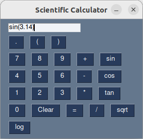

# Scientific Calculator

## Description
 This is a scientific calculator which uses a PySimpleGUI window. 
 


This calculator allows both mouse and keyboard inputs. 

## Installation

1. clone the repository: `https://github.com/hermonochy/scalc`
2. enter the repository: `cd scalc`

This repository has no requirements.

## Startup

For Linux users, enter `./scientific_calculator`, For windows, `python scientific_calculator`.

## Technical details

Python has a function `eval()`, which can take any string and process it like command in a script. 
Trig functions, logarithm and square roots are not available after starting up, so they have to be imported: `from math import sin,cos,log,tan,sqrt`
With this import, `eval(sin(0))` works, and there is no need to write `eval(math.sin(0))`.

The program also demonstrates how to catch keyboard events:
When creating the window, it is important to add the `finalize` parameter and set it to `True`, like so:
```
window = sg.Window('Scientific Calculator', layout, finalize=True)
```
Then, the ENTER key can be bound to the input field, using it's key:
```
window['-DISPLAY-'].bind("<Return>", "_Enter")
```
The input field is part of the layout, and was defined like this:
```
[sg.Input(size=(20, 1), key='-DISPLAY-')]
```
Inside the event loop, the ENTER key can now be caught by:
```
if event == '-DISPLAY-_Enter'
```

## Future work
- Add more scientific functions
- Show expression as tree
- Show expression in reverse notation

